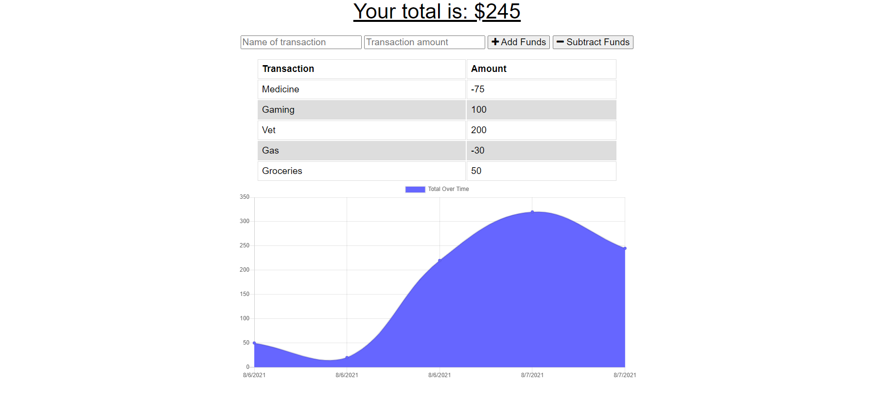

# Online-Offline-Budget-Tracker

# Description

An online/offline budget tracker can help folks keep track of their expenses. It helps to maintain organization and to help plan your future expenses.

# User Story

AS AN avid traveller

I WANT to be able to track my withdrawals and deposits with or without a data/internet connection 

SO THAT my account balance is accurate when I am traveling

# Business Context

Giving users a fast and easy way to track their money is important, but allowing them to access that information anytime is even more important. Having offline functionality is paramount to our applications success.

# Acceptance Criteria

GIVEN a user is on Budget App without an internet connection 

WHEN the user inputs a withdrawal or deposit 

THEN that will be shown on the page, and added to their transaction history when their connection is back online.

# Considerations

Don't forget to attach your service worker and reference your database correctly within your code. If you don't, it causes complications within the application and can not function properly. Also add more console logs to keep track of errors.

# Collaborators

Angelica Sargent

# Screenshot

# Link

Check out this [link](https://serene-journey-66363.herokuapp.com/)!